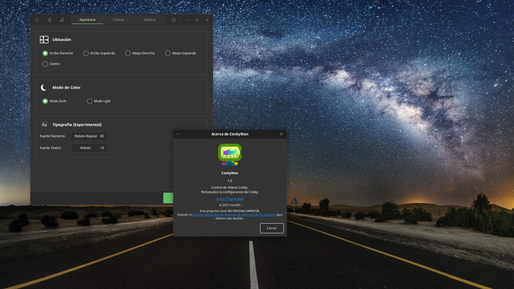

# ConkyMan For CuerdOS

ConkyMan is a powerful customization tool designed to manage Conky's aesthetics and functionality through a modern GTK3 graphical interface. Its goal is to simplify Linux desktop configuration, allowing users to adjust positions, switch between light and dark modes, and choose accent colors without manually editing code.

# How does it work?

It works by searching for specific values in `conky.lua` and modifying them without touching the rest of the code. ConkyMan also comes with a pre-built text editor for experienced users who don't want to search for the specific `.conkyrc` or `conky.config` files.

# Commonly asked questions

Does it work with any GNU/Linux distribution?
● Yes, but it will only load and modify the CuerdOS configuration file for Conky.

Why Conky doesn't load when I click "Apply Changes"?
● Make sure you have Conky installed in your system. Otherwise, Click the refresh button on the headerbar and check if that works.

I broke the Conky configuration file, what should I do?
● Click the restore defaults" button on the headerbar, this will load the default Conky configuration file.

# Copyright

@2026 CuerdOS Dev Team, This program comes with the GNU LGPLv3 licence, consult https://www.gnu.org/licenses/lgpl-3.0.html for more information.

