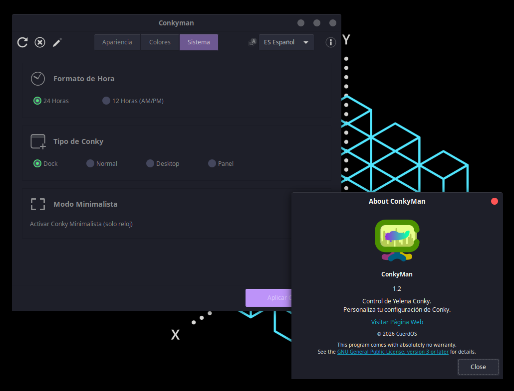

# ConkyMan For CuerdOS

<p align="center">
  
</p>



## What is ConkyMan?

**ConkyMan** is a powerful customization tool designed to manage **Conky**'s aesthetics and functionality through a modern **GTK3** graphical interface. Its goal is to simplify Linux desktop configuration, allowing users to adjust positions, switch between light and dark modes, and choose accent colors without manually editing code.

## Characteristics

- **User-friendly graphical interface**
- **Broad compatibility with any modern GNU/Linux distribution**
- **Fast and lightweight**

## How does it work?

It works by searching for specific values in `conky.lua` and modifying them without touching the rest of the code. **ConkyMan** also comes with a pre-built text editor for 
experienced users who don't want to search for the specific `.conkyrc` or `conky.config` files.

## What version should I choose?
**ConkyMan** works better with Xfce and Gnome desktop environments; **ConkyManRC** offers better compatibility with desktop environments like **Mate** and **LXQT** **ConkyManRC** also adds addons, which are features not offered in the standard **Yelena Conky**.

## Requirements
- **Python3.x**
- **Conky**
- **GTK 3**
- **PyGObject**

## Instalation
Clone the repository and run the app:

```bash
git clone https://github.com/Just-Alex22/ConkyMan.git
cd ConkyMan
python3 conkyman.py
```

## Contributing
If you want to collaborate with the development of **ConkyMan**, follow us on github send your **Pull Requests** and **Issues** through the repository

## Licence
This program comes with the GNU LGPLv3 licence, consult https://www.gnu.org/licenses/lgpl-3.0.html for more information.

---

> **Backend:** [Just_Alex](https://github.com/Just-Alex22)
> **Frontend:** [GatoVerde95](https://github.com/gatoverde95)
> **Repository:** [ConkyMan](https://github.com/Just-Alex22/ConkyMan)

